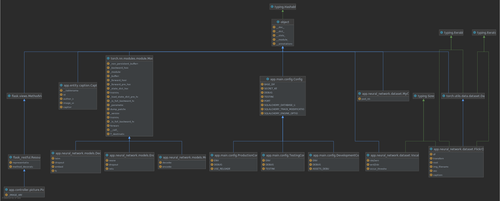
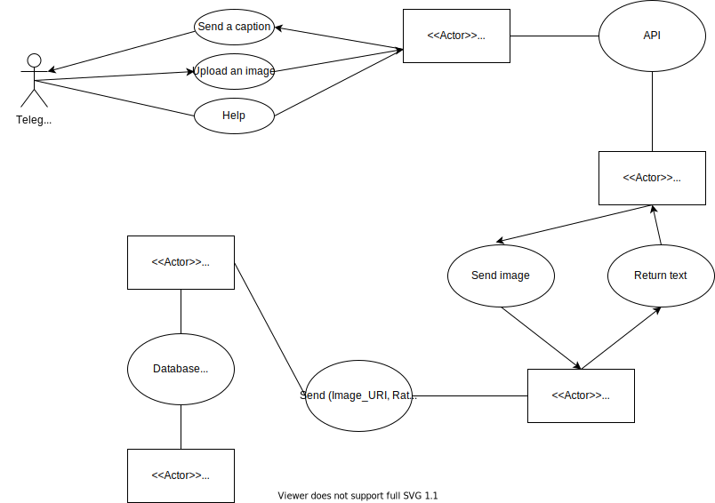

## Design Documentation

We decided to use Flask framework to create a server working with the bot and the application.
Beside the fact that our team already acquainted with this framework, it allows us to use HTTP protocol to serve requests making the system modular.
Flask is a framework that already has decent inner architecture obeying its own design pattern and principles.

### Design Patterns 

As the users of Flask framework, we don't have to care much about the architecture of the server software.
Nevertheless, we can present some design patterns that we had to use. 

1. Front Controller
```python
from flask_restful import Resource


class Picture(Resource):

    _IMAGE_ARG: str = 'image'

    def get(self) -> Tuple[any, int]:
        # TODO: Return caption
        caption = 'GET request has not been implemented yet :)'
        return caption, 200

    def post(self) -> Optional[Tuple[any, int]]:

        parser = RequestParser()
        parser.add_argument(
            Picture._IMAGE_ARG,
            type=FileStorage,
            location='files',
            required=True)

        args = parser.parse_args()

        image_file: FileStorage = args[Picture._IMAGE_ARG]
        image_name, image_path = save_image(file=image_file)

        caption = retrieve_caption(image_path=image_path)

        response = {
            'imageURL': image_name,
            'caption': caption
        }

        print(response)

        return response, 200
```
We decided to use this pattern since we need to have some basic class for handling API requests

### UML diagrams
If you have problems with reading any UML diagram, open it separately
1. Class diagram for the server (with the neural network)

   
2. Telegram bot flowchart <br />

   
3. Use Case Diagram <br />

   
4. Sequence Diagram <br />

   
### SOLID Principles
- __Single responsibility principle__ <br />
	As we can see from the UML diagram, on the server-side we have 2 supportive neural networks: Encoder and Decoder. And main neural network Model has these two neural nets for working.
- __Open–closed principle__ <br />
	Model is a closed class. It can be retrained based on a new dataset, which we give. But it can be extended for the new neural networks or to an improved one.
- __Liskov substitution principle__ <br />
	All neural networks take images and return a caption. No matter what goes on inside. Therefore a new neural network inherited on Module won’t give errors.
- __Interface segregation principle__ <br />
	Our project is not so big to have this principle. We don’t have many classes, each of which needs its own interface.
- __Dependency inversion principle__ <br />
	Not used.

### System Architecture
The service has a client-server architecture. Here are the different views:  

1. Static View <br />


2. Dynamic View (UML Components Diagram)


3. Allocation View (UML Deployment Diagram)
