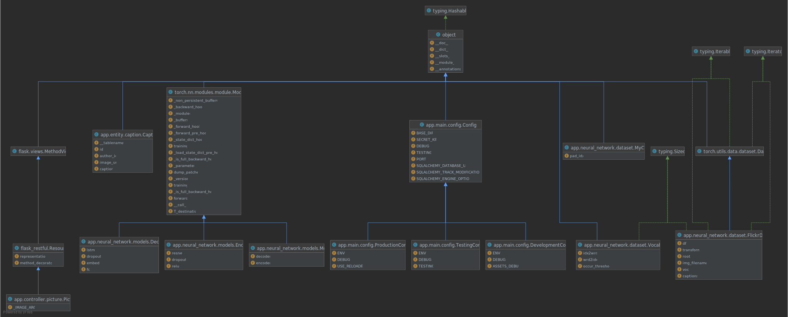
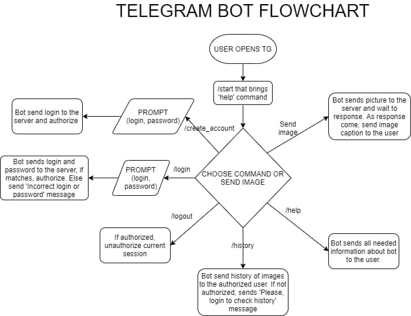
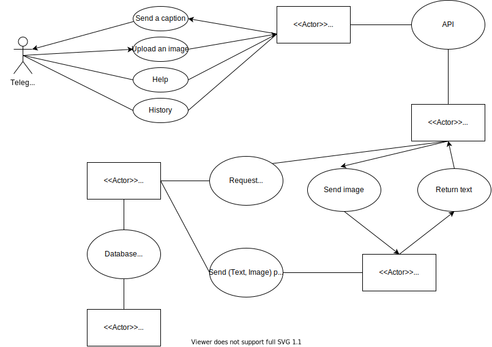
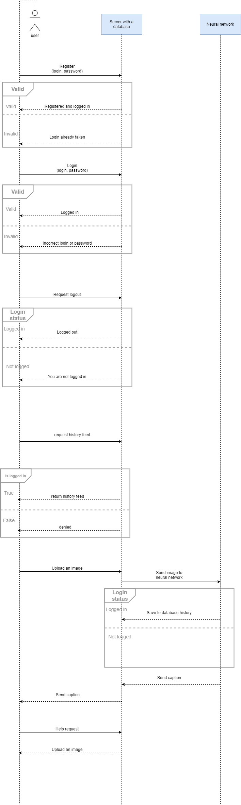
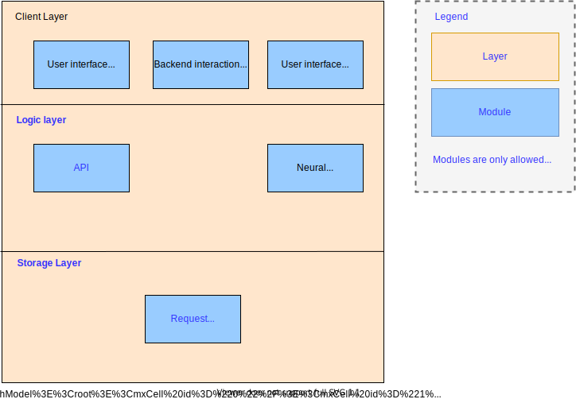
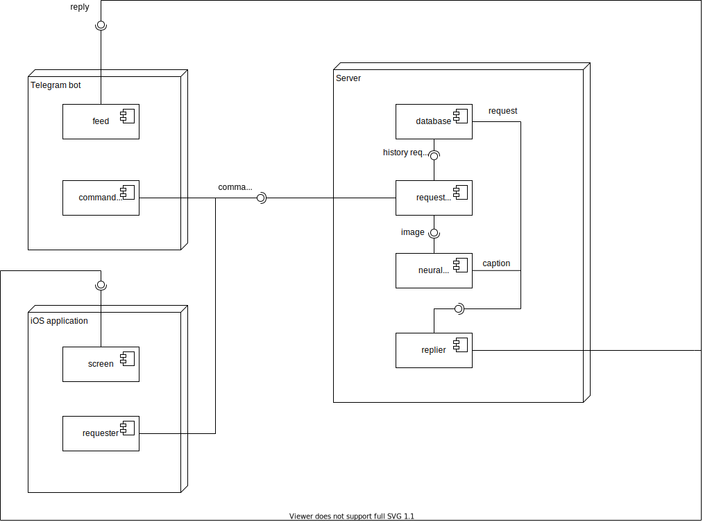
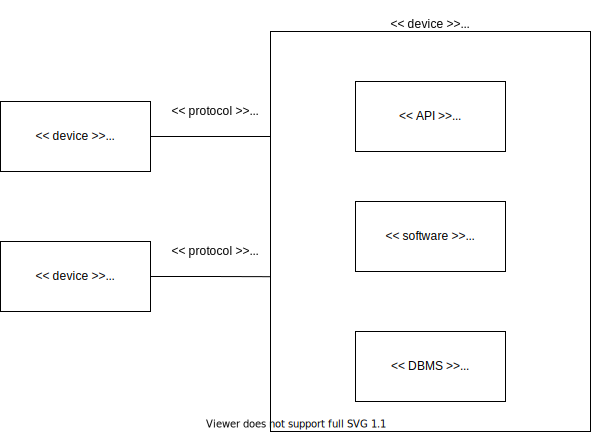
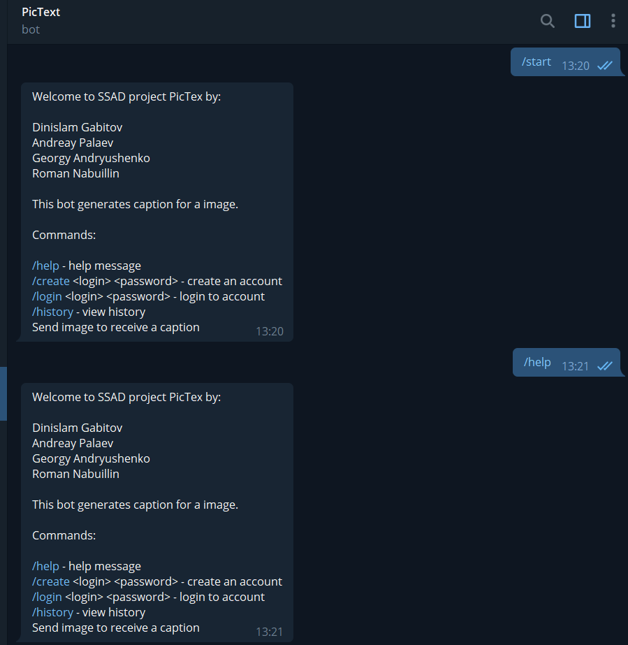
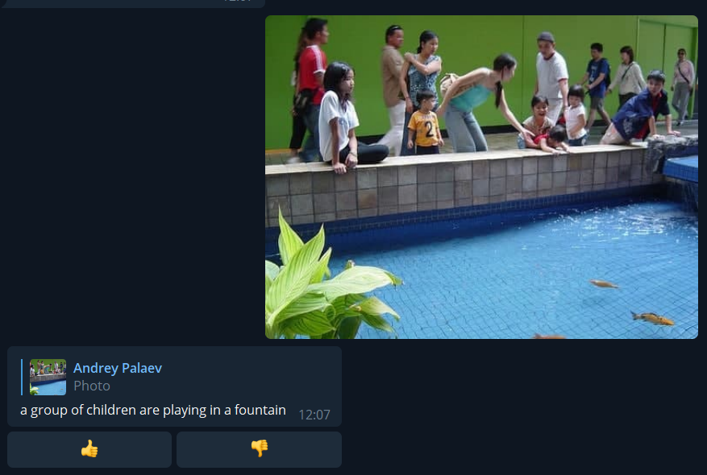

# PicTex
## Description
Are you an English learner? Want to give impressive descriptions of the pictures? 
PicTex is a service that provides you generated descriptions of the images that you send!
With the examples generated by our neural network, you may master the common task for English exams of describing the pictures.
Available through either the telegram bot.  

## Glossary
- __Telegram bot__
    Telegram bots are small programs that can embed in Telegram chats or public channels and perform a specific function
- __Neural network (artificial network network)__
    Neural networks reflect the behavior of the human brain, allowing computer programs to recognize patterns and solve common problems in the fields of AI, machine learning, and deep learning.

- __Client__
    Client is a piece of computer hardware or software that accesses a service made available by a server as part of the client–server model of computer networks.
- __Server__
    A server is a computer or system that provides resources, data, services, or programs to other computers, known as clients, over a network.
- __API (Application Programming Interface)__
    Software intermediary that allows two applications to talk to each other.
- __Image caption__
    Image captions, also known as cutlines, are a few lines of text used to explain and elaborate on published photographs
  

## Design Documentation

We decided to use Flask framework to create a server working with the bot and the application.
Beside the fact that our team already acquainted with this framework, it allows us to use HTTP protocol to serve requests making the system modular.
Flask is a framework that already has decent inner architecture obeying its own design pattern and principles.

### Design Patterns 

As the users of Flask framework, we don't have to care much about the architecture of the server software.
Nevertheless, we can present some design patterns that we had to use. 

1. Front Controller
```python
from flask_restful import Resource


class Picture(Resource):

    _IMAGE_ARG: str = 'image'

    def get(self) -> Tuple[any, int]:
        # TODO: Return caption
        caption = 'GET request has not been implemented yet :)'
        return caption, 200

    def post(self) -> Optional[Tuple[any, int]]:

        parser = RequestParser()
        parser.add_argument(
            Picture._IMAGE_ARG,
            type=FileStorage,
            location='files',
            required=True)

        args = parser.parse_args()

        image_file: FileStorage = args[Picture._IMAGE_ARG]
        image_name, image_path = save_image(file=image_file)

        caption = retrieve_caption(image_path=image_path)

        response = {
            'imageURL': image_name,
            'caption': caption
        }

        print(response)

        return response, 200
```
We decided to use this pattern since we need to have some basic class for handling API requests

### UML diagrams
If you have problems with reading any UML diagram, open it separately
1. Class diagram for the server (with the neural network)

   
2. Telegram bot flowchart <br />

   
3. Use Case Diagram <br />

   
4. Sequence Diagram <br />

   
### SOLID Principles
- __Single responsibility principle__ <br />
	As we can see from the UML diagram, on the server-side we have 2 supportive neural networks: Encoder and Decoder. And main neural network Model has these two neural nets for working.
- __Open–closed principle__ <br />
	Model is a closed class. It can be retrained based on a new dataset, which we give. But it can be extended for the new neural networks or to an improved one.
- __Liskov substitution principle__ <br />
	All neural networks take images and return a caption. No matter what goes on inside. Therefore a new neural network inherited on Module won’t give errors.
- __Interface segregation principle__ <br />
	Our project is not so big to have this principle. We don’t have many classes, each of which needs its own interface.
- __Dependency inversion principle__ <br />
	Not used.

### System Architecture
The service has a client-server architecture. Here are the different views:  

1. Static View <br />


2. Dynamic View (UML Components Diagram)


3. Allocation View (UML Deployment Diagram)

   
### Telegram bot prototype




## Repositories
The project consists of several separate repositories that contain the code for different modules:
1. Picture-Inspector-server
https://github.com/PictureInspector/Picture-Inspector-server
2. pictureinspector-bot
https://github.com/PictureInspector/picture-inspector-bot

## RUP Artifacts
The link to the Google Doc
https://docs.google.com/document/d/1JceCxH50G0CmYeWyNwu0b_wnpNrjkoyM/edit?usp=sharing&ouid=113379756477507623253&rtpof=true&sd=true

## Authors
Roman Nabiullin  
Dinislam Gabitov  
Andrey Palaev  
Georgy Andryushchenko  
