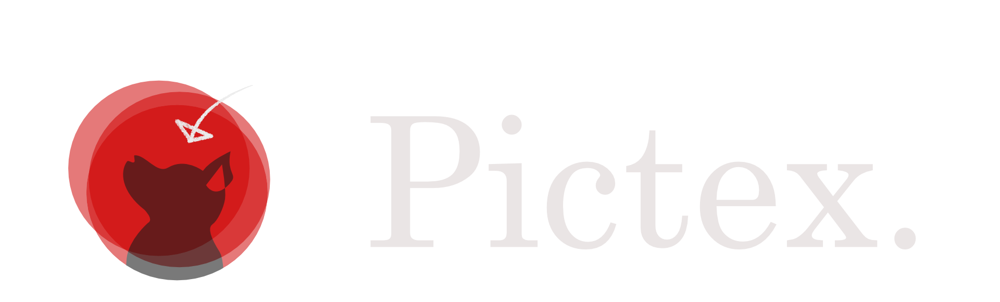
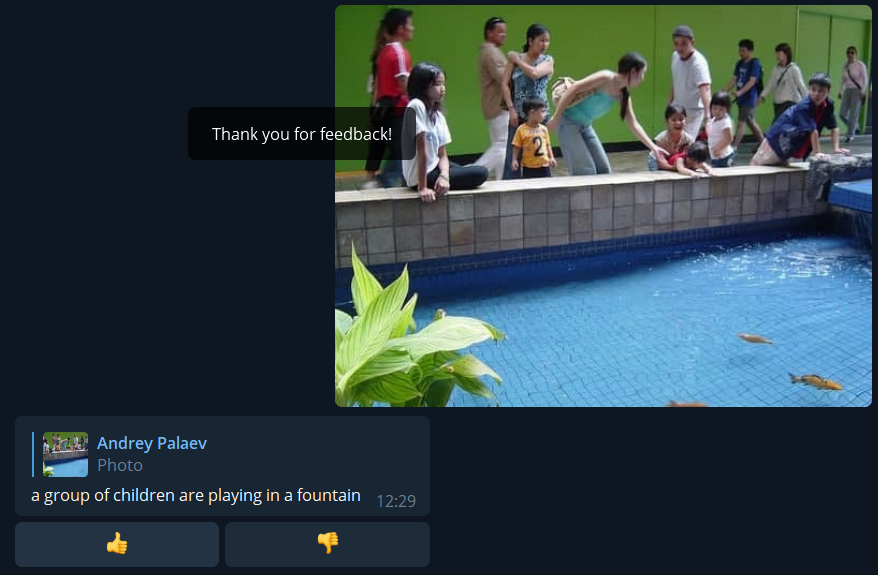

# PicTex
## Description
Are you an English learner? Want to give impressive descriptions of the pictures? 
PicTex is a service that provides you generated descriptions of the images that you send!
With the examples generated by our neural network, you may master the common task for English exams of describing the pictures.
Available through either the telegram bot.  

## Telegram bot link
https://t.me/SSD_PicText_bot

## Demo

## Telegram bot prototype
1. First, you need to start the bot:

2. Then, you send the image and get the caption for it: 

3. If you want, you can give the feedback depending on whether you like the caption or not:

## Installation guide

### Python installation

To run this server you need to install [Python3+](https://realpython.com/installing-python/).
And [pip](https://pip.pypa.io/en/stable/installation/).

### Server installation

Clone server repository from https://github.com/PictureInspector/Picture-Inspector-server

Follow the instructions: https://github.com/PictureInspector/Picture-Inspector-server/blob/develop/README.md

### Telegram bot installation
 
Clone telegram bot repository from https://github.com/PictureInspector/picture-inspector-bot

Follow the instructions: https://github.com/PictureInspector/picture-inspector-bot/blob/develop/README.md
## Repositories
The project consists of several repositories that contain the code for different modules:
1. Picture-Inspector-server
https://github.com/PictureInspector/Picture-Inspector-server
2. picture-inspector-bot
https://github.com/PictureInspector/picture-inspector-bot
   
We did it this way because the server with the neural network and the bot are logically independent parts of the system.

## Glossary
- __Telegram bot__
    Telegram bots are small programs that can embed in Telegram chats or public channels and perform a specific function
- __Neural network (artificial network network)__
    Neural networks reflect the behavior of the human brain, allowing computer programs to recognize patterns and solve common problems in the fields of AI, machine learning, and deep learning.

- __Client__
    Client is a piece of computer hardware or software that accesses a service made available by a server as part of the client–server model of computer networks.
- __Server__
    A server is a computer or system that provides resources, data, services, or programs to other computers, known as clients, over a network.
- __API (Application Programming Interface)__
    Software intermediary that allows two applications to talk to each other.
- __Image caption__
    Image captions, also known as cutlines, are a few lines of text used to explain and elaborate on published photographs
  
## RUP Artifacts
The link to the Google Doc
https://docs.google.com/document/d/1JceCxH50G0CmYeWyNwu0b_wnpNrjkoyM/edit?usp=sharing&ouid=113379756477507623253&rtpof=true&sd=true

## Design documentation
You can read the design documentation using this [link](Documentation.md)

## How to contribute
If you find any bug or have suggestion on improvement, you can:
1. Fork the server or the bot repository, make the changes and then create a pull request
2. Open the issue with the description of the bug/suggestion

## Authors
Roman Nabiullin  
Dinislam Gabitov  
Andrey Palaev  
Georgy Andryushchenko  

